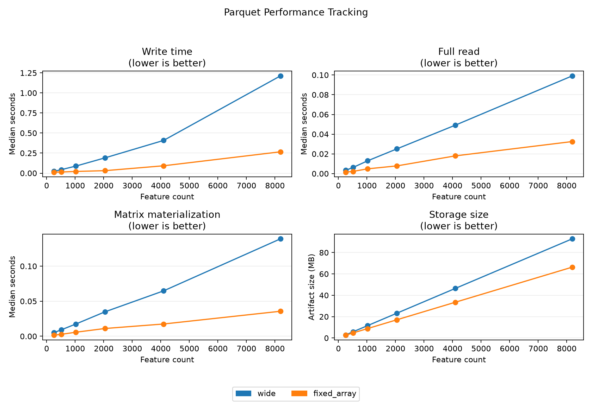

# Array We There Yet?

This project compares two ways to store high-dimensional profile data.
High-dimensional data means each row has many numeric values.

The benchmark compares a wide table with an array-like layout.
A wide table has one column for each feature.
An array-like layout stores one row of features in one field.

## At a Glance

The starter benchmark uses synthetic data with 2,000 rows and up to 8192
features. Synthetic data is generated data with known values.

Early results show three useful patterns:

- Vortex and Lance fixed arrays made matrix materialization much faster than their wide tables.
- Parquet fixed arrays made full reads and matrix materialization faster than Parquet wide tables.
- CSV packed arrays were slower than CSV wide tables for most operations.

The benchmark is not a final ranking. It shows where each layout helps or hurts.

<!-- array-we-there-yet-results:start -->

## Current Results

These starter results use synthetic data with 8192 features.
A ratio less than 1.0 favors the array-like layout.
The primary plot shows each array-like result divided by its wide baseline.

Use the plot images below to see the main comparisons.
Use the linked tables when you need exact rows.

Summary of findings:

- The largest time gain is lance fixed_array for matrix materialization at 0.001x wide.
- The largest time loss is csv json_array for feature projection at 11.8x wide.
- The smallest array-like artifact is parquet fixed_array at 0.715x wide.
- The largest array-like artifact is csv json_array at 1.8x wide.

Primary facet plots:


Figure 1. Time panels show time ratios. The storage panel shows size ratios. Matrix materialization means reading the data into one `N x D` numeric array. Feature projection means reading only selected features. Vector norm means the length of each feature vector. Median Time shows the middle time ratio. Worst Time shows the largest time ratio. Ratios let different operations fit in one compact figure. The y-axis uses a log scale to show small and large changes. Values less than 1.0 favor the array-like layout.

Parquet performance tracking:



Figure 2. Parquet tracking shows absolute time and storage for wide and fixed-array layouts. Lower values are better.

Detailed result files:

- [CSV ratio table](results/ratio_summary.csv)
- [Parquet ratio table](results/ratio_summary.parquet)
- [CSV Parquet tracking table](results/parquet_performance.csv)
- [Parquet tracking table](results/parquet_performance.parquet)

Raw results are in `results/raw_results.parquet` and `results/raw_results.csv`.
Summary results are in `results/summary.parquet` and `results/summary.csv`.

Detailed per-operation plot files remain in `figures/`.

<!-- array-we-there-yet-results:end -->

## Layouts

The benchmark currently writes these layouts:

| Backend | Wide layout            | Array-like layout                |
| ------- | ---------------------- | -------------------------------- |
| CSV     | One column per feature | Delimited string and JSON string |
| Parquet | One column per feature | `FixedSizeList<float32>`         |
| DuckDB  | One column per feature | List column                      |
| Vortex  | One column per feature | `FixedSizeList<float32>`         |
| Lance   | One column per feature | `FixedSizeList<float32>`         |

For packed and fixed-array layouts, `feature_names.json` is measured with the
artifact size. This accounts for feature names that the wide schema stores
directly.

## Operations

Each run measures these operations:

- Write the full dataset.
- Read the full table.
- Materialize an `N x D` NumPy matrix.
- Read a fixed set of random profiles.
- Project a fixed set of features.
- Compute one row-wise L2 norm vector.

The report stores absolute timings and array-to-wide ratios. For time and
storage ratios, values less than `1.0` favor the array-like layout.

The combined facet plot shows the ratios first.
The per-operation files in `figures/` keep the detailed views.

## Short Terms

| Term                   | Meaning                                             |
| ---------------------- | --------------------------------------------------- |
| Artifact               | A file or directory written by a benchmark run.     |
| Backend                | The storage system that writes and reads the data.  |
| Feature                | One numeric measurement for a profile row.          |
| Matrix materialization | Reading data and creating an `N x D` NumPy array.   |
| Metadata               | Descriptive columns, such as sample ID or plate ID. |
| Packed array           | An array stored as text inside one CSV field.       |
| Ratio                  | The array-like result divided by the wide result.   |

For ratios, a value less than `1.0` favors the array-like layout.
A value more than `1.0` favors the wide layout.

## Background

A table is data in rows and columns.
It is a data idea, not one file format.

A wide layout spreads one vector across many feature columns.
An array-like layout stores one vector in one column.

Syntax is the data form, such as one column or many columns.
Semantics are the data meaning, such as one profile vector.

A fixed-size array carries a length rule with the data.
That rule tells other tools how many values belong to each row.

## Usage

Install dependencies with `uv`:

```bash
uv sync
```

Run the starter benchmark and update this README:

```bash
uv run array-we-there-yet run
```

Run a small smoke benchmark:

```bash
uv run array-we-there-yet run --rows=100 --dimensions=8 --measured_repetitions=1 --warmups=0
```

## Outputs

The benchmark writes these files:

- `results/raw_results.parquet`
- `results/raw_results.csv`
- `results/summary.parquet`
- `results/summary.csv`
- `results/ratio_summary.parquet`
- `results/ratio_summary.csv`
- `results/parquet_performance.parquet`
- `results/parquet_performance.csv`
- `results/environment.json`
- `figures/*.png`

The benchmark also writes storage artifacts under `results/artifacts/`.

## Development

This repository was generated from
[`CU-DBMI/template-uv-python-research-software`](https://github.com/CU-DBMI/template-uv-python-research-software).
It keeps the template structure for `uv`, `pytest`, pre-commit, and local agent guidance.

Run tests:

```bash
uv run pytest
```

Run Ruff checks:

```bash
uv run ruff check src tests
uv run ruff format --check src tests
```

Run the full local pipeline:

```bash
uv run poe pipeline
```
