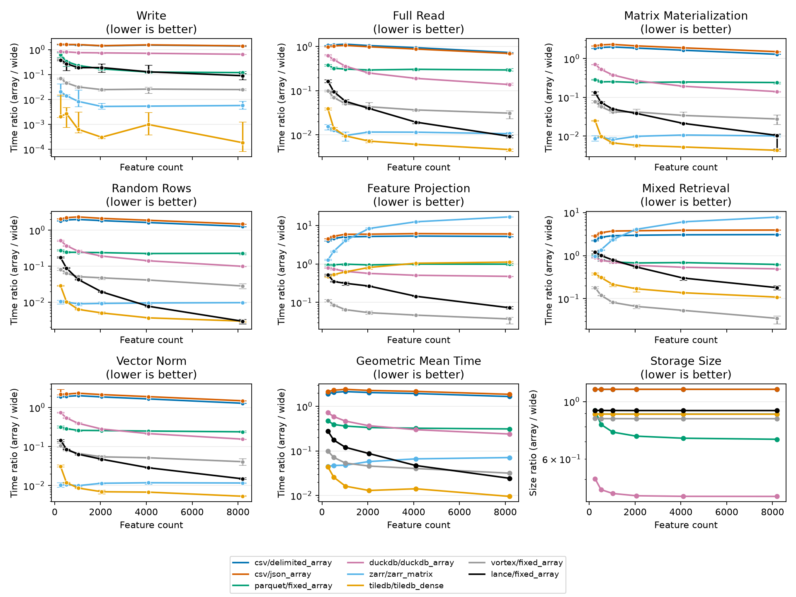
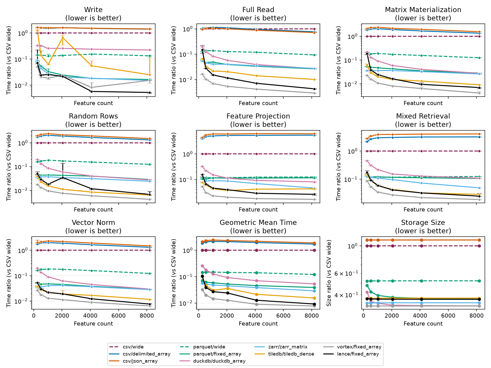
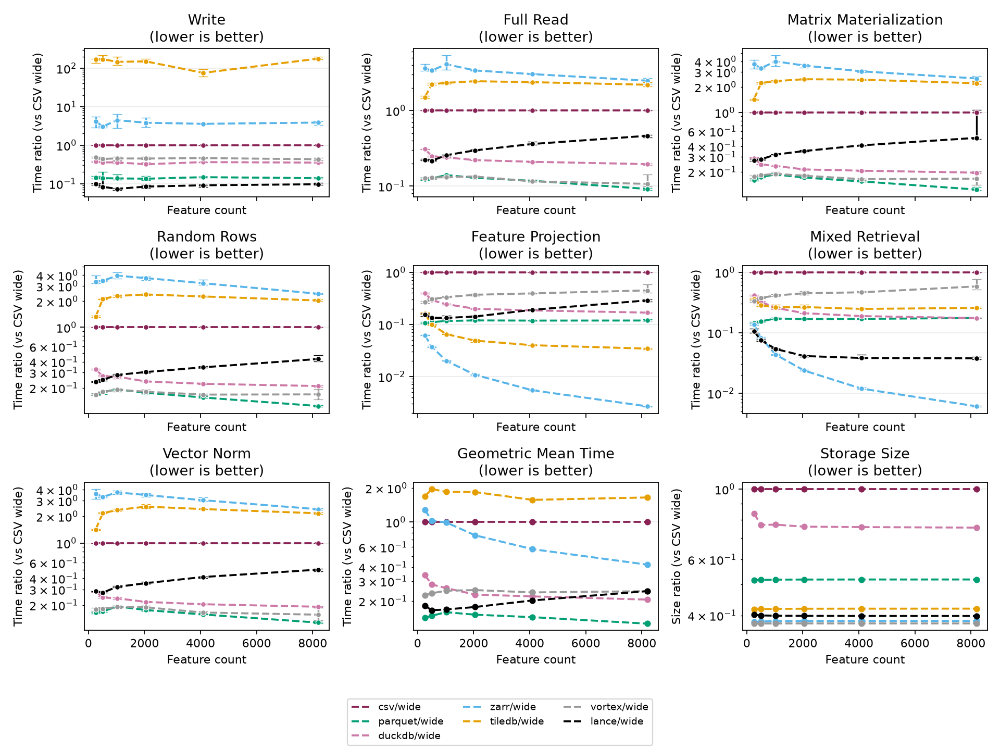
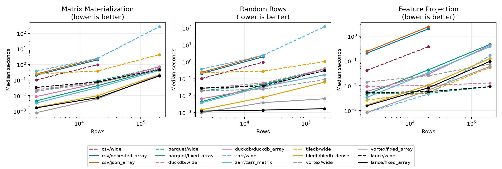
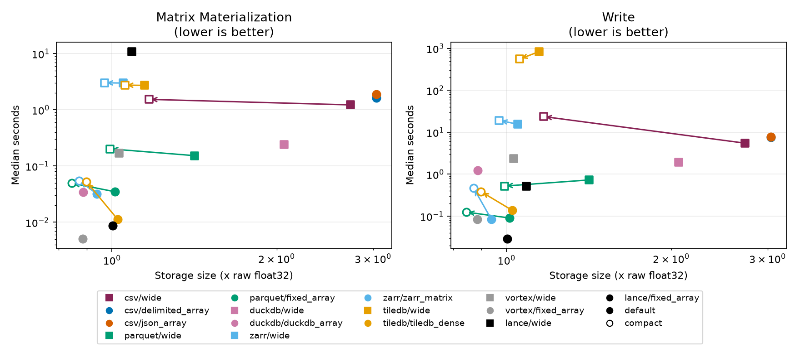

# Array We There Yet?

A benchmark of storage formats for high-dimensional profile data.
Profile data has one row for each sample, such as a well of cells or a document,
and hundreds to thousands of numeric measurements for each row. These
measurements are called features. Image-based profiling and embedding models
produce this kind of data. The storage layout decides how fast a team can load
the data and how much it costs to move it.

The benchmark compares seven storage backends. For each backend, it measures a
wide layout against an array-like layout:

- A wide layout has one column for each feature.
- An array-like layout stores all features of one row in a single field.

The results compare each array-like layout with the wide layout in its own
format. They also compare every layout with CSV wide, the most common way to
share this kind of data. CSV is a text format, so ratios against it exaggerate
the gain of any binary format.

<!-- array-we-there-yet-results:start -->

## Summary

> **Main finding.** Array-like layouts read whole feature matrices 4.1x to 230x faster than wide layouts in 6 of 7 backends. Reading only 8 features gives mixed results.

- **Whole-matrix reads.** Matrix materialization is faster with the array-like layout in TileDB (230x), Zarr (99x), Lance (96x), Vortex (36x), DuckDB (7.1x), and Parquet (4.1x). It is slower in CSV (1.4x).
- **Selecting a few features.** Reading 8 features is faster in Vortex (27x), Lance (14x), and DuckDB (2.1x). It is about the same in Parquet. It is slower in Zarr (17x), CSV (5.6x), and TileDB (1.1x).
- **Text packing.** CSV packed arrays are slower than CSV wide for write, matrix materialization, random rows, feature projection, mixed retrieval, and vector norm, and faster only for full read. They are 11% larger.
- **Encoding settings matter.** Parquet's array layout is 29% smaller than its wide layout by default and 15% smaller with the compact profile. Default dictionary encoding inflates the wide layout.
- **Real-world impact.** For a 1.5 GB CSV wide file, Parquet `fixed_array` takes 5.9 s per use instead of 26 s and costs $0.050 instead of $0.135 in egress. See Real-world example.
- **Limits.** These results come from a single machine, synthetic data, warm caches, Python bindings, and 6 repetitions per timing. See Limitations.

## Plots

The benchmark used synthetic data with 2,000 rows and 256 to 8,192 features. Each timing is the median of 6 repetitions.

### How to read the figures

- Each panel shows one operation or one summary measure.
- Lower is better in every panel.
- Ratio panels divide one result by a reference result. A value of 1.0 means the same as the reference.
- Geometric Mean Time is the geometric mean of the time ratios across all operations. The geometric mean is the standard way to average ratios.
- Error bars show the q25-to-q75 range across repetitions.
- The y-axis uses a log scale to show small and large changes.
- Dashed lines are wide layouts. Solid lines are array-like layouts.

### Array-like layouts against their own wide layout



Figure 1. Each array-like layout divided by the wide layout of the same backend. Values below 1.0 favor the array-like layout. This is the fairest comparison, because both layouts use the same format.

### Every layout against CSV wide



Figure 2. Every layout divided by CSV wide, which is the flat line at 1.0. Parquet wide is the only other wide layout shown here. The section Wide layouts shows all of them.

CSV wide is the reference because it is the most common way to share this kind of data. It is a text format, so ratios against it exaggerate the gain of any binary format. The figure before this one is the fairer comparison: each array-like layout against a wide layout in the same format.

### Wide layouts



Figure 3. Wide layouts only, divided by CSV wide, which is the flat line at 1.0.

## Real-world example

**What egress is.** Cloud providers charge for storing a file and, separately, for data that leaves their network. The second charge is called egress. It applies each time someone downloads a file from cloud storage to a computer outside the provider's network, and it is billed per gigabyte.

**Why it matters for hosting a dataset.** A team that shares a dataset pays egress each time someone downloads it. The bill grows with the number of users and with the file size, and it keeps growing after the dataset stops changing. A smaller file lowers the bill in direct proportion. Some providers offer a requester-pays option, where the person who downloads pays instead of the host.

**Why it matters for using a dataset.** A researcher who works on a laptop or in another cloud waits for every download, and pays the fee when the host does not. The wait starts again each time the data is read into memory. File size sets the download time. The format sets the read time.

**The egress costs here are an estimate.** They use one list price to show the size of the effect on a single example. Prices differ by provider, region, storage service, and volume, and they change over time.

This example asks what it costs to move and read a 1.5 GB CSV wide file, and how much the other layouts save. The file holds about 16,800 rows of 8,192 features. A use is one download followed by one read into memory.

**Takeaway.** With Parquet `fixed_array`, one use takes 5.9 s instead of 26 s and costs $0.050 instead of $0.135 in egress. Over 1,000 uses that saves 5.6 h and $85.

**Size as Parquet.** The same data takes 0.55 GB as a Parquet file with the array layout, 63% smaller than the 1.5 GB CSV wide file. With compact settings it takes 0.46 GB, 69% smaller. As a Parquet wide file it takes 0.81 GB, 46% smaller.

### One use

| Layout                               | Size    | Download | Read into memory | Total time | Egress cost |
| ------------------------------------ | ------- | -------- | ---------------- | ---------- | ----------- |
| CSV `wide`                           | 1.5 GB  | 15 s     | 11 s             | 26 s       | $0.135      |
| CSV `wide` (compact)                 | 0.64 GB | 6.4 s    | 13 s             | 20 s       | $0.058      |
| Parquet `wide`                       | 0.81 GB | 8.1 s    | 0.6 s            | 8.7 s      | $0.073      |
| Parquet `fixed_array`                | 0.55 GB | 5.5 s    | 0.37 s           | 5.9 s      | $0.050      |
| Parquet `fixed_array` (compact)      | 0.46 GB | 4.6 s    | 0.58 s           | 5.2 s      | $0.042      |
| DuckDB `duckdb_array`                | 0.88 GB | 8.8 s    | 0.38 s           | 9.2 s      | $0.079      |
| Zarr `zarr_matrix`                   | 0.51 GB | 5.1 s    | 0.33 s           | 5.5 s      | $0.046      |
| TileDB `tiledb_dense`                | 0.57 GB | 5.7 s    | 0.16 s           | 5.9 s      | $0.051      |
| Vortex `fixed_array`                 | 0.48 GB | 4.8 s    | 0.11 s           | 5 s        | $0.044      |
| Lance `fixed_array`                  | 0.55 GB | 5.5 s    | 0.11 s           | 5.6 s      | $0.049      |
| Parquet `wide` (8 features streamed) | 4.9 MB  | 0.049 s  | 0.32 s           | 0.36 s     | $0.0004     |

The streamed row is for a user who needs only 8 features. The other rows download and read the whole file.

Compact rows use the compact write profile, which writes smaller files and can cost time. See Write settings.

### Savings over 1,000 uses

Time spent and egress spent are the totals over 1,000 uses. Time saved and egress cost saved compare a layout with CSV wide. Time is the download plus the read.

| Layout                               | Time spent | Egress spent | Time saved | Egress cost saved |
| ------------------------------------ | ---------- | ------------ | ---------- | ----------------- |
| CSV `wide`                           | 7.2 h      | $135         | baseline   | baseline          |
| CSV `wide` (compact)                 | 5.5 h      | $58          | 1.7 h      | $77               |
| Parquet `wide`                       | 2.4 h      | $73          | 4.8 h      | $62               |
| Parquet `fixed_array`                | 1.6 h      | $50          | 5.6 h      | $85               |
| Parquet `fixed_array` (compact)      | 1.4 h      | $42          | 5.8 h      | $93               |
| DuckDB `duckdb_array`                | 2.5 h      | $79          | 4.7 h      | $56               |
| Zarr `zarr_matrix`                   | 1.5 h      | $46          | 5.7 h      | $89               |
| TileDB `tiledb_dense`                | 1.6 h      | $51          | 5.6 h      | $84               |
| Vortex `fixed_array`                 | 1.4 h      | $44          | 5.9 h      | $91               |
| Lance `fixed_array`                  | 1.6 h      | $49          | 5.7 h      | $85               |
| Parquet `wide` (8 features streamed) | 6.1 min    | $0.438       | 4.8 h      | $134              |

The streamed row compares with CSV wide, which downloads the whole file and reads only 8 features.

### Streaming a Parquet file

Parquet stores a footer that lists where every column and row group is. A client can read the footer and then request only the byte ranges it needs from cloud storage. Egress is billed for the bytes that are sent, so a partial read costs less than a full download. A CSV file cannot be read in part by column, because every row holds every column.

The wide layout can skip features. The array layout stores all features of a row in one column, so it cannot. Row selection saves egress only when the file has several row groups and the rows you need are together. These files use one row group, so the row numbers below assume row groups of about 1,000 rows.

| What you read       | CSV wide | Parquet wide      | Parquet `fixed_array` |
| ------------------- | -------- | ----------------- | --------------------- |
| Everything          | 1.5 GB   | 0.81 GB           | 0.55 GB               |
| 8 features of 8,192 | 1.5 GB   | 4.9 MB (measured) | 0.55 GB               |
| 1,000 rows          | 1.5 GB   | 48 MB (estimate)  | 33 MB (estimate)      |

Reading 8 features from Parquet wide sends 4.9 MB, which costs $0.0004 in egress, against $0.135 for the CSV file. The footer is 4.1 MB (measured).

### Scaling check

The benchmark data is small, so we wrote and read files of about 16,800 rows to check the scaled numbers. The tables above use the measured size and read time for these layouts.

| Layout                          | Scaled size | Measured size | Scaled read | Measured read |
| ------------------------------- | ----------- | ------------- | ----------- | ------------- |
| CSV `wide`                      | 1.5 GB      | 1.5 GB        | 11 s        | 11 s          |
| CSV `wide` (compact)            | 0.64 GB     | 0.64 GB       | 13 s        | 13 s          |
| Parquet `wide`                  | 0.78 GB     | 0.81 GB       | 1.3 s       | 0.6 s         |
| Parquet `fixed_array`           | 0.56 GB     | 0.55 GB       | 0.32 s      | 0.37 s        |
| Parquet `fixed_array` (compact) | 0.46 GB     | 0.46 GB       | 0.44 s      | 0.58 s        |
| DuckDB `duckdb_array`           | 0.49 GB     | 0.88 GB       | 0.29 s      | 0.38 s        |
| Zarr `zarr_matrix`              | 0.52 GB     | 0.51 GB       | 0.27 s      | 0.33 s        |
| TileDB `tiledb_dense`           | 0.56 GB     | 0.57 GB       | 0.1 s       | 0.16 s        |
| Vortex `fixed_array`            | 0.49 GB     | 0.48 GB       | 0.049 s     | 0.11 s        |
| Lance `fixed_array`             | 0.55 GB     | 0.55 GB       | 0.056 s     | 0.11 s        |

Measured sizes are within 10% of the scaled sizes, except DuckDB `duckdb_array` (1.8x larger). Measured read times are within 1.5x of the scaled times, except Parquet `wide` (2.2x faster), TileDB `tiledb_dense` (1.5x slower), Vortex `fixed_array` (2.2x slower), and Lance `fixed_array` (1.9x slower).

Egress pricing pages:

- [AWS S3](https://aws.amazon.com/s3/pricing/): the source of the $0.09 per GB used here.
- [Google Cloud](https://cloud.google.com/vpc/network-pricing): egress is billed per GiB and depends on the source region.
- [Azure](https://azure.microsoft.com/en-us/pricing/details/bandwidth/): the first 100 GB each month is free, and the rate depends on the region.
- [Cloudflare R2](https://developers.cloudflare.com/r2/pricing/): no egress charges. The host pays for storage and operations instead.

Check the current page before you plan a budget.

Assumptions:

- Download speed is 100 MB/s.
- Egress costs $0.09 per GB. This is the AWS list price for data transfer out to the internet, first 10 TB each month ([AWS S3 pricing](https://aws.amazon.com/s3/pricing/)). The first 100 GB each month is free on AWS. The table ignores this, so it overstates the cost at low volume.
- Sizes and read times of the layouts in the scaling check were measured on a real file of about 16,800 rows. Other rows are scaled from the benchmark data by size.
- Read times use one thread and warm caches, except for Lance and Vortex. See Limitations.
- 1 GB is 1,000,000,000 bytes.

## Detailed results

### Key findings

Each cell compares the array-like layout with the wide layout of the same backend at 8,192 features. A negative percentage means faster or smaller. A positive percentage means slower or larger. For example, +100% means twice as slow or twice as large, and -50% means half the time or size. Feature projection reads 8 of 8,192 features, which is the best case for a wide layout.

| Backend | Layout            | Matrix materialization | Feature projection | Write     | Storage size |
| ------- | ----------------- | ---------------------- | ------------------ | --------- | ------------ |
| CSV     | `delimited_array` | +30%                   | +420%              | +39%      | +11%         |
| CSV     | `json_array`      | +51%                   | +500%              | +41%      | +11%         |
| Parquet | `fixed_array`     | -76%                   | -1%                | -88%      | -29%         |
| DuckDB  | `duckdb_array`    | -86%                   | -52%               | -35%      | -57%         |
| Zarr    | `zarr_matrix`     | -99%                   | +1,600%            | -99%\*    | -10%         |
| TileDB  | `tiledb_dense`    | -99.57%                | +12%               | -99.98%\* | -11%         |
| Vortex  | `fixed_array`     | -97%                   | -96%               | -98%      | -14%         |
| Lance   | `fixed_array`     | -99%\*                 | -93%               | -91%      | -8%          |

An asterisk (`*`) marks a cell whose measurement varies by more than half of its median. 14 of 630 measurements (2%) vary this much.

These layouts used more than one thread in at least one operation: Lance `fixed_array` (median 0.93, up to 3.6), Lance `wide` (median 2, up to 3.8), Vortex `fixed_array` (median 2.5, up to 7), Vortex `wide` (median 1.1, up to 3.2). Parallelism is CPU time divided by wall time, so 1.0 means one busy thread. The benchmark cannot limit the native thread pools of Lance and Vortex.

Measured in CPU time, which counts every thread, matrix materialization with the array-like layout is 7.4x faster in Vortex (36x faster in wall time).

Access path check: for every layout, matrix materialization takes at most 3 times as long as a full read, and random rows take at most 3 times as long as matrix materialization.

### Distance from a plain NumPy file

A NumPy `.npy` file loads into memory in 4.3 ms at 8,192 features. For matrix materialization this is a floor, because no format can be faster than a memory copy. For random rows and feature projection it is a baseline, not a floor. A row-major file is a poor layout for reading a few columns, so a value below 1x is possible. Each cell divides the time of a layout by the time of the plain file, so 1x is as fast as the plain file.

| Layout                | Matrix materialization | Random rows | Feature projection |
| --------------------- | ---------------------- | ----------- | ------------------ |
| CSV `wide`            | 300x                   | 3,000x      | 140x               |
| CSV `delimited_array` | 390x                   | 3,900x      | 700x               |
| CSV `json_array`      | 450x                   | 4,500x      | 810x               |
| Parquet `wide`        | 37x                    | 370x        | 16x                |
| Parquet `fixed_array` | 8.9x                   | 85x         | 16x                |
| DuckDB `wide`         | 58x                    | 630x        | 23x                |
| DuckDB `duckdb_array` | 8.2x                   | 63x         | 11x                |
| Zarr `wide`           | 750x                   | 7,400x      | 0.36x              |
| Zarr `zarr_matrix`    | 7.6x                   | 71x         | 6.1x               |
| TileDB `wide`         | 660x                   | 6,200x      | 4.6x               |
| TileDB `tiledb_dense` | 2.9x                   | 18x         | 5.2x               |
| Vortex `wide`         | 50x                    | 510x        | 61x                |
| Vortex `fixed_array`  | 1.4x                   | 14x         | 2.2x               |
| Lance `wide`          | 150x                   | 1,300x      | 39x                |
| Lance `fixed_array`   | 1.6x                   | 3.8x        | 2.8x               |

### Scaling with row count

The row count grows 100x, from 2,000 to 200,000 rows, at 1,024 features. Each cell divides the time at 200,000 rows by the time at 2,000 rows. Time that grows 100x is linear in the row count. A smaller value means the time grew more slowly than the rows.



Figure 4. Median time against row count. Both axes use a log scale.

| Layout                | Matrix materialization | Random rows | Feature projection |
| --------------------- | ---------------------- | ----------- | ------------------ |
| Parquet `wide`        | 35x                    | 20x         | 1.9x               |
| Parquet `fixed_array` | 110x                   | 89x         | 100x               |
| DuckDB `wide`         | 23x                    | 14x         | 1.4x               |
| DuckDB `duckdb_array` | 83x                    | 59x         | 73x                |
| Zarr `wide`           | 720x                   | 320x        | 210x               |
| Zarr `zarr_matrix`    | 120x                   | 45x         | 110x               |
| TileDB `wide`         | 17x                    | 4.5x        | 21x                |
| TileDB `tiledb_dense` | 130x                   | 43x         | 76x                |
| Vortex `wide`         | 25x                    | 4.7x        | 5.3x               |
| Vortex `fixed_array`  | 270x                   | 6.7x        | 74x                |
| Lance `wide`          | 14x                    | 11x         | 1.7x               |
| Lance `fixed_array`   | 110x                   | 1.4x        | 62x                |

Matrix materialization grew the most in Zarr `wide` (720x) and the least in Lance `wide` (14x). Random rows grew the most in Zarr `wide` (320x) and the least in Lance `fixed_array` (1.4x).

CSV was measured only up to 20,000 rows.

### Encoding sensitivity

Encoding and compression choices change file size and speed. This table checks whether the array-versus-wide results hold under both write profiles. Each cell shows the array-like layout relative to the wide layout of the same backend, first with the default profile and then with the compact profile. The last column says whether every measure stays on the same side of wide, better or worse, in both profiles. This does not mean that the size of the effect stays the same.

| Backend | Layout         | Storage size | Matrix materialization | Feature projection | Write             | Conclusion        |
| ------- | -------------- | ------------ | ---------------------- | ------------------ | ----------------- | ----------------- |
| Parquet | `fixed_array`  | -29% → -15%  | -76% → -75%            | -1% → +89%         | -88% → -81%       | Reverses          |
| Zarr    | `zarr_matrix`  | -10% → -10%  | -99% → -98%            | +1,600% → +2,700%  | -99% → -98%       | Same side of wide |
| TileDB  | `tiledb_dense` | -11% → -15%  | -99.57% → -98%         | +12% → +330%       | -99.98% → -99.93% | Same side of wide |

### Encodings observed

The table lists the compression and encodings that each format wrote at the largest feature count. Bytes per value is the artifact size divided by the number of stored values. A raw `float32` value takes 4 bytes. Most size differences between the binary formats come from default compression and encoding choices, not from the layout. Random values compress poorly, so the sizes describe this data set and not real profile data. Sizes are for 2,000 rows and can change with more rows.

Parquet turns on dictionary encoding by default. Every value in this data is unique, so the dictionary adds overhead. Parquet wide takes 5.67 bytes per value by default and 3.97 with the compact profile. DuckDB wide takes 8.26 bytes per value, about 2.1x the raw size. The benchmark did not investigate why. It stores 8,192 columns of 2,000 values each.

| Backend | Layout            | Profile | Compression and encodings                            | Bytes per value |
| ------- | ----------------- | ------- | ---------------------------------------------------- | --------------- |
| CSV     | `wide`            | default | uncompressed decimal text                            | 10.92           |
| CSV     | `wide`            | compact | gzip-compressed decimal text                         | 4.68            |
| CSV     | `delimited_array` | default | uncompressed decimal text                            | 12.17           |
| CSV     | `json_array`      | default | uncompressed decimal text                            | 12.17           |
| Parquet | `wide`            | default | snappy; PLAIN, RLE, RLE_DICTIONARY                   | 5.67            |
| Parquet | `wide`            | compact | zstd; BYTE_STREAM_SPLIT, RLE                         | 3.97            |
| Parquet | `fixed_array`     | default | snappy; PLAIN, RLE, RLE_DICTIONARY                   | 4.05            |
| Parquet | `fixed_array`     | compact | zstd; BYTE_STREAM_SPLIT, RLE                         | 3.38            |
| DuckDB  | `wide`            | default | FLOAT; ALP, ALPRD, Constant                          | 8.26            |
| DuckDB  | `duckdb_array`    | default | FLOAT[8192]; ALPRD, Constant                         | 3.55            |
| Zarr    | `wide`            | default | Blosc lz4 level 5, byte shuffle                      | 4.20            |
| Zarr    | `wide`            | compact | Blosc zstd level 5, byte shuffle                     | 3.88            |
| Zarr    | `zarr_matrix`     | default | Blosc lz4 level 5, byte shuffle                      | 3.76            |
| Zarr    | `zarr_matrix`     | compact | Blosc zstd level 5, byte shuffle                     | 3.48            |
| TileDB  | `wide`            | default | attributes: none; dimensions: Zstd                   | 4.59            |
| TileDB  | `wide`            | compact | attributes: ByteShuffle + Zstd; dimensions: Zstd     | 4.23            |
| TileDB  | `tiledb_dense`    | default | attributes: none; dimensions: Zstd                   | 4.10            |
| TileDB  | `tiledb_dense`    | compact | attributes: ByteShuffle + Zstd; dimensions: Zstd     | 3.59            |
| Vortex  | `wide`            | default | encodings chosen by Vortex                           | 4.12            |
| Vortex  | `fixed_array`     | default | encodings chosen by Vortex                           | 3.54            |
| Lance   | `wide`            | default | encodings chosen by Lance (data storage version 2.2) | 4.35            |
| Lance   | `fixed_array`     | default | encodings chosen by Lance (data storage version 2.2) | 4.01            |

### Appendix: storage size against time

This appendix uses synthetic random data. It shows how the compact profile moves the size and the time of each format. It is not a ranking of formats for real data.



Figure 5. Storage size against time at the largest feature count. Each arrow goes from the default profile (filled) to the compact profile (open). Points without an arrow have no compact profile. Squares are wide layouts and circles are array-like layouts. Lower and further left is better.

Changes from the default profile to the compact profile:

| Layout                | Storage size | Matrix materialization | Write |
| --------------------- | ------------ | ---------------------- | ----- |
| CSV `wide`            | -57%         | +25%                   | +330% |
| Parquet `wide`        | -30%         | +32%                   | -11%  |
| Parquet `fixed_array` | -17%         | +36%                   | +42%  |
| Zarr `wide`           | -8%          | -1%                    | +17%  |
| Zarr `zarr_matrix`    | -7%          | +69%                   | +240% |
| TileDB `wide`         | -8%          | 0%                     | -19%  |
| TileDB `tiledb_dense` | -12%         | +330%                  | +190% |

The compact profile changes only the write settings in Write settings. DuckDB, Lance, and Vortex have no compact profile.

<!-- array-we-there-yet-results:end -->

## Layouts

The benchmark writes these layouts:

| Backend | Wide layout               | Array-like layout                |
| ------- | ------------------------- | -------------------------------- |
| CSV     | One column per feature    | Delimited string and JSON string |
| Parquet | One column per feature    | `FixedSizeList<float32>`         |
| DuckDB  | One column per feature    | `FLOAT[N]` fixed-size array      |
| Zarr    | One array per feature     | 2D chunked feature array         |
| TileDB  | One attribute per feature | Dense 2D array                   |
| Vortex  | One column per feature    | `FixedSizeList<float32>`         |
| Lance   | One column per feature    | `FixedSizeList<float32>`         |

For packed and fixed-array layouts, the size of `feature_names.json` is included
in the artifact size. This accounts for the feature names that a wide schema
stores in its columns.

Parquet has no fixed-size list type. PyArrow writes the `FixedSizeList` layout as
an ordinary variable-length list and restores the fixed size from the Arrow
schema stored in the file metadata. Readers that do not use that schema see a
variable-length list.

## Operations

Each run measures these operations:

| Operation              | Description                                                                                                     |
| ---------------------- | --------------------------------------------------------------------------------------------------------------- |
| Write                  | Write the full dataset.                                                                                         |
| Full read              | Read the full table.                                                                                            |
| Matrix materialization | Read the data into one `N x D` NumPy array.                                                                     |
| Random rows            | Read 128 random rows, using each format's own row-selection call. CSV has none, so it reads the whole file.     |
| Feature projection     | Read a fixed set of features.                                                                                   |
| Mixed retrieval        | Read metadata and selected features together, using each format's row-selection call. CSV reads the whole file. |
| Vector norm            | Read the matrix as in matrix materialization, then compute the L2 norm of each row in NumPy.                    |

Each result is stored as an absolute time. The report also stores ratios to CSV
wide and ratios to the wide layout of the same backend.

## Methodology

- **Data.** Each feature count uses a separate synthetic dataset with a fixed
  seed of 42. It has 2,000 rows, independent standard-normal `float32` features,
  and three string metadata columns: `sample_id`, `plate_id`, and `well_id`.
- **Protocol.** For each backend, layout, and feature count, the benchmark
  writes the dataset several times to new artifacts. It then times each read
  operation on the last artifact. One warmup run comes before the measured runs.
- **Timing.** Wall time comes from `time.perf_counter`. CPU time comes from
  `time.process_time`, which counts every thread in the process. Checking the
  returned values happens after the timer stops and is not included. A read that
  takes less than 50 ms repeats inside one sample until the sample lasts at least
  50 ms. The benchmark divides the sample time by the number of calls and stores
  the call count in the raw results. This removes most of the timer and
  thread-start noise from fast reads.
- **Cache state.** The benchmark does not drop the operating system page cache.
  All reads are warm-cache reads.
- **Selections.** Random rows and projected features are 128 rows and 8 features
  chosen with fixed seeds. The counts do not change with the feature count.
  Each format selects rows with its own call: `take` in Lance, `dataset.take` in
  Parquet, `rowid` in DuckDB, `scan(indices=...)` in Vortex, `oindex` in Zarr, and
  `multi_index` in TileDB. The dataset has 2,000 rows in one row group or chunk,
  so most formats still decode the whole block. For them random rows costs about
  as much as matrix materialization.
- **Column requests.** Wide layouts are read with a full scan followed by a column
  selection. The benchmark never names thousands of columns in one request.
  Lance takes about 1.35 ms for each column that a request names. Naming all
  8,192 columns took 11 s, against 0.57 s for a full scan that returns the same
  values.
- **Returned objects.** Matrix materialization returns a NumPy array for every
  backend. Full read returns the native object of each library: an Arrow table,
  a pandas DataFrame, or a dictionary of arrays. Full read times therefore
  include different conversion work.
- **Statistics.** Each timing is the median of all repetitions. The results pool
  independent runs of the same code, so the error bars show the variation
  between runs and not only within one run. Error bars are the q25-to-q75 range.
  Ratios divide medians. Summary panels average ratios with the geometric mean.
  A measurement that varies by more than half of its median is marked with `*`.
  Pooling refuses runs from different commits or from uncommitted code.
- **Threads.** The benchmark asks for one thread. It enforces this for Arrow,
  DuckDB, TileDB, and the Blosc compressor that Zarr uses. Lance and Vortex use
  native thread pools that the benchmark cannot limit. The `median_parallelism`
  column in `results/summary.parquet` is the CPU time divided by the wall time. A
  value near 1.0 means one thread was busy. A larger value means more than one.
  For layouts that used more than one thread, the results also compare CPU time,
  which counts every thread.
- **Correctness.** Every write and read is checked for shape, `float32` type, and
  values within `1e-6` of the source data.
- **Access path check.** For each layout, matrix materialization should take
  about as long as a full read, and random rows should not take longer than
  matrix materialization. The report flags a layout that takes more than three
  times as long. This check finds readers that ask a library for far more than an
  operation needs.
- **Plain file.** A plain NumPy `.npy` file is timed for the same operations. For
  matrix materialization it is the speed of a memory copy, so no format can be
  faster. For random rows and feature projection it is a baseline: a row-major
  file is a poor layout for reading a few columns. The report divides each
  layout's time by the time of the plain file.
- **Row sweep.** The benchmark runs again at 2,000, 20,000, and 200,000 rows and
  1,024 features. CSV stops at 20,000 rows, because its files are 2.7 times the
  raw size and it is the slowest format. The report divides the time at the most
  rows by the time at the fewest, so linear growth is 100 times.
- **Scaling check.** The real-world example scales sizes and read times from the
  2,000-row benchmark. The scaling check writes and reads a real file of about
  1.5 GB for each layout of the example, and compares the measured size and read
  time with the scaled ones. It also measures the bytes that a client downloads to
  read 8 columns of a Parquet file, from the footer and the column chunk sizes.
- **Encodings.** Each format runs with its default settings. Formats with a
  verified compression setting also run a compact profile. Encoding and
  compression choices change file size and speed. The Encoding sensitivity table
  checks whether the array-versus-wide results hold under both profiles. The
  Encodings observed table lists what each format wrote.
- **Artifact size.** The size is the bytes on disk, including `feature_names.json`
  for layouts that store no column names.

<!-- array-we-there-yet-setup:start -->

## Environment

| Item         | Value                                                                                                   |
| ------------ | ------------------------------------------------------------------------------------------------------- |
| CPU          | Apple M4 Pro (12 logical cores)                                                                         |
| Memory       | 48 GiB                                                                                                  |
| Platform     | macOS-26.7-arm64-arm-64bit                                                                              |
| Python       | 3.11.13                                                                                                 |
| Code version | `80a73b6`                                                                                               |
| Runs         | 2 independent runs of the same code, pooled                                                             |
| `duckdb`     | 1.5.5                                                                                                   |
| `lance`      | 12.0.0                                                                                                  |
| `numpy`      | 2.2.6                                                                                                   |
| `pandas`     | 2.2.3                                                                                                   |
| `pyarrow`    | 25.0.1                                                                                                  |
| `tiledb`     | 0.36.1                                                                                                  |
| `vortex`     | 0.86.1                                                                                                  |
| `zarr`       | 2.18.7                                                                                                  |
| Threads      | Arrow CPU 1, Arrow I/O 1, DuckDB 1, TileDB 1, Zarr Blosc 1; Lance and Vortex use their library defaults |

## Backends and access paths

| Backend | Package or binding              | Layouts measured                        |
| ------- | ------------------------------- | --------------------------------------- |
| CSV     | `pandas` CSV I/O                | `wide`, `delimited_array`, `json_array` |
| Parquet | `pyarrow.parquet`               | `wide`, `fixed_array`                   |
| DuckDB  | `duckdb` Python package         | `wide`, `duckdb_array`                  |
| Zarr    | `zarr` Python package           | `wide`, `zarr_matrix`                   |
| TileDB  | `tiledb` Python package         | `wide`, `tiledb_dense`                  |
| Vortex  | `vortex-data` (`vortex` import) | `wide`, `fixed_array`                   |
| Lance   | `lance` Python package          | `wide`, `fixed_array`                   |

The timings include each package and binding, not only the storage layout. Different language layers can change the result.

<!-- array-we-there-yet-setup:end -->

## Write settings

The benchmark writes every layout with a **default** profile. It uses only the
settings listed here. All other settings are the defaults of the package version
in the Environment table.

Formats with a compression setting that the benchmark verified also run a
**compact** profile. It writes smaller files and can cost time. The plots use
only the default profile. The Encoding sensitivity table and the appendix
compare the two.

| Backend | Default profile                                                                                                                       | Compact profile                                                        |
| ------- | ------------------------------------------------------------------------------------------------------------------------------------- | ---------------------------------------------------------------------- |
| CSV     | No compression. Packed arrays use 9 significant digits per value.                                                                     | `gzip` on the wide layout only.                                        |
| Parquet | `snappy` compression through `pyarrow.parquet.write_table`. Dictionary encoding is on.                                                | `zstd`, dictionary encoding off, and byte-stream split on float data.  |
| DuckDB  | One `CREATE TABLE` followed by `CHECKPOINT`. Arrays are `FLOAT[N]`.                                                                   | None. DuckDB chooses its own compression.                              |
| Zarr    | Chunks of 1,024 rows. The matrix layout also uses at most 1,024 features. The default Blosc compressor: `lz4`, level 5, byte shuffle. | Blosc with `zstd`, level 5, byte shuffle.                              |
| TileDB  | Dense array. Tile extents of at most 1,024 rows and 1,024 features. No attribute filters.                                             | Byte shuffle followed by `zstd` at level 5 on the attributes.          |
| Vortex  | None. The benchmark calls `vortex.io.write` with defaults.                                                                            | None. The benchmark found no setting to change.                        |
| Lance   | None. The benchmark calls `lance.write_dataset` with defaults.                                                                        | None. The compression settings that the benchmark tried had no effect. |

## Limitations

- **Scale.** The main benchmark has 2,000 rows, about 65 MB at the largest
  feature count. The row sweep goes to 200,000 rows at 1,024 features, about
  820 MB, and the scaling check reads a real 1.5 GB file. All of these fit in
  memory. None of them shows reads that exceed memory. The sweep is one run and
  is not pooled. CSV was measured only up to 20,000 rows in the sweep.
- **Repetitions.** Each run makes 3 repetitions of each measurement. The results
  pool the runs listed in the Environment table. Write timings vary the most,
  especially TileDB writes. They can differ between runs by many times. The
  report marks measurements that vary by more than half of their median.
- **Cache.** The results do not show cold-storage or object-storage reads.
- **Data.** Independent random values are close to the worst case for compression.
  The best possible lossless size for this data is about 3.3 bytes per value. The
  storage sizes say little about the dictionary, run-length, and delta encodings
  that real profile data would use. The data has no missing values and one
  numeric type.
- **Machine.** All results come from one machine, described in the Environment
  table.
- **Software stack.** Timings include the Python bindings and the conversion to
  the returned object. They do not measure the storage formats alone.
- **Tuning.** The benchmark runs two profiles. Neither profile is tuned for the
  data. Other row-group sizes, chunk sizes, and codecs can change the results.
  Vortex, Lance, and DuckDB have no compact profile.
- **Scope.** The benchmark does not measure filters, updates, concurrent access,
  schema changes, vector search, or tool support.

## Terminology

| Term                   | Meaning                                                                                               |
| ---------------------- | ----------------------------------------------------------------------------------------------------- |
| Array-like layout      | A layout that stores all features of a row in one field.                                              |
| Artifact               | A file or directory that a benchmark run writes.                                                      |
| Backend                | A storage format and the library that reads it. DuckDB is a database engine with its own file format. |
| Compact profile        | Write settings that make smaller files and can cost time. See Write settings.                         |
| Egress                 | The fee that a cloud provider charges when data leaves its network, billed per gigabyte.              |
| Feature                | One numeric measurement for a row.                                                                    |
| Matrix materialization | Reading data into an `N x D` NumPy array.                                                             |
| Metadata               | Descriptive columns, such as sample ID or plate ID.                                                   |
| Packed array           | An array stored as text inside one CSV field.                                                         |
| Ratio                  | One result divided by a reference result.                                                             |
| Row group              | A block of rows in a Parquet file. A reader can skip whole row groups.                                |
| Streaming              | Reading part of a file with byte-range requests, so that only those bytes are sent.                   |
| Wide layout            | A layout that stores each feature in its own column.                                                  |

## Usage

Install the dependencies with [`uv`](https://docs.astral.sh/uv/):

```bash
uv sync
```

Run the full benchmark and update the results section of this README:

```bash
uv run array-we-there-yet run
```

The defaults use 2,000 rows, 256 to 8,192 features, three measured repetitions,
and one warmup run. A full run takes about 4 hours on the machine in the
Environment table.

Run the same code twice, each time into its own directory, then pool the runs:

```bash
uv run array-we-there-yet run --output_dir=results_a --figure_dir=figures_a --update_readme_file=False
uv run array-we-there-yet run --output_dir=results_b --figure_dir=figures_b --update_readme_file=False
uv run array-we-there-yet combine --inputs=results_a,results_b
```

Run the row sweep, and the scaling check that writes and reads a real 1.5 GB
file. Both use the results of the main run:

```bash
uv run array-we-there-yet sweep
uv run array-we-there-yet scaling
```

The sweep takes about 4.5 hours, and the scaling check takes about 15 minutes.

Rebuild the tables, figures, and README from saved raw results without a new
run:

```bash
uv run array-we-there-yet report
```

Run a small smoke test:

```bash
uv run array-we-there-yet run --rows=100 --dimensions=8 --measured_repetitions=1 --warmups=0
```

## Outputs

The benchmark writes these files:

| Path                                        | Contents                                                  |
| ------------------------------------------- | --------------------------------------------------------- |
| `results/raw_results.parquet`               | One row per measurement.                                  |
| `results/summary.parquet`                   | Median and quartile timings and artifact sizes.           |
| `results/csv_wide_ratio_summary.parquet`    | Ratios to CSV wide.                                       |
| `results/wide_layout_ratio_summary.parquet` | Wide layout ratios to CSV wide.                           |
| `results/ratio_summary.parquet`             | Array-like ratios to the wide layout of the same backend. |
| `results/profile_comparison.parquet`        | Compact profile ratios to the default profile.            |
| `results/encodings.parquet`                 | Compression and encodings that each format wrote.         |
| `results/row_sweep_summary.parquet`         | Median timings at 2,000, 20,000, and 200,000 rows.        |
| `results/row_sweep_raw.parquet`             | One row per measurement of the row sweep.                 |
| `results/scaling_check.parquet`             | Size, write time, and read time of the 1.5 GB files.      |
| `results/floor_results.parquet`             | One row per measurement of the plain NumPy file.          |
| `results/floor_summary.parquet`             | Median timings of the plain NumPy file.                   |
| `results/environment.json`                  | Configuration and package versions.                       |
| `figures/*.png`                             | Figures, including one plot for each operation.           |

The benchmark deletes the storage artifacts of each layout after it measures
that layout. A full run needs about 1.2 GB of free disk space. The run saves
`raw_results.parquet` and `encodings.parquet` after each feature count, so a
failed run keeps the feature counts that finished.

All result tables are Parquet files. The benchmark does not write CSV copies.
Read them with `pandas.read_parquet`.

## Development

This repository comes from the
[`CU-DBMI/template-uv-python-research-software`](https://github.com/CU-DBMI/template-uv-python-research-software)
template. It uses `uv`, `pytest`, and pre-commit.

Run the tests:

```bash
uv run pytest
```

Run the Ruff checks:

```bash
uv run ruff check src tests
uv run ruff format --check src tests
```

Run the full local pipeline:

```bash
uv run poe pipeline
```
